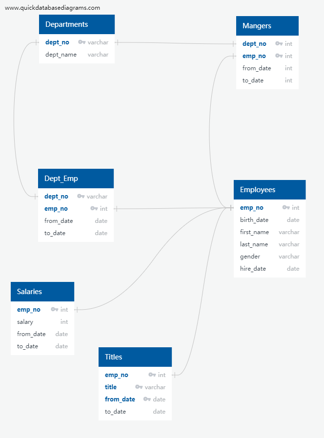
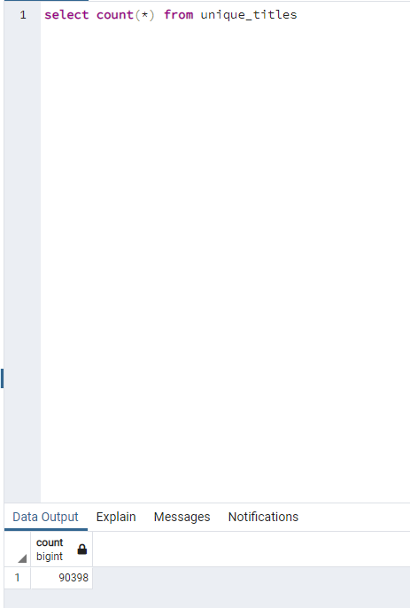
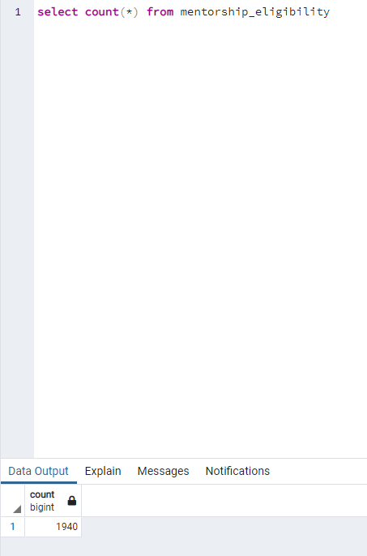

# Pewlett-Hackard-Analysis

## Overview of the analysis
Pewlett Hackard is a big company. They want to find 
- who will be retired next years?
- how many positions need to be filled?

Using the csv files they provided, I created an ERD diagram and the database showing below：

In this project, I will use query language to  
- create a Retirement Titles table that holds all the titles of current employees who were born between January 1, 1952 and December 31, 1955.
- create a mentorship-eligibility table that holds the current employees who were born between January 1, 1965 and December 31, 1965.

## Result
To create these two tables, I will
- use "inner join" to join two tables
- use "into" to save tables
- use "distinct on" to remove duplicated employees because some employees switch titles over years
- use "order by" to sort the data
- use group by to show the number of employees in each department

### Retirement Titles Table
Without deleting duplicated rows, the table is saved as retirement_titles.csv and it is like below:

After "dinstinct on", duplicated items are deleted and the data is saved as unique_titles.csv:

The group_by table is saved as retiring_titles.csv and it looks like:

### mentorship-eligibility Table
Using the same method, I created the second table:

## Summary 
There are in total 90398 people who will retire soon, so the same amount of new employees are needed.

There are only in total 1940 eligible mentors, which may not enough to teach the next generation of employees

